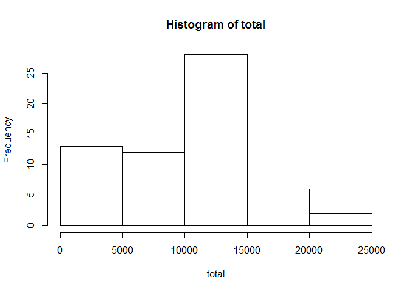
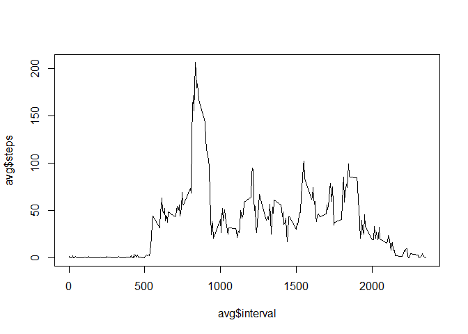
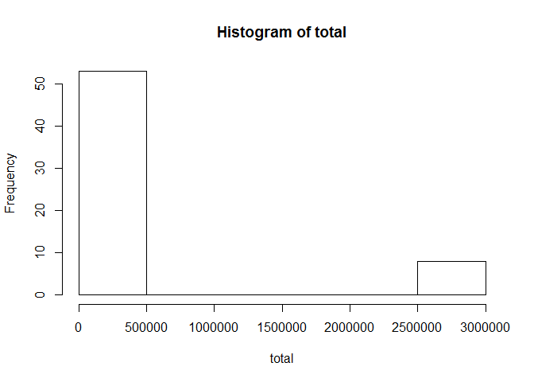
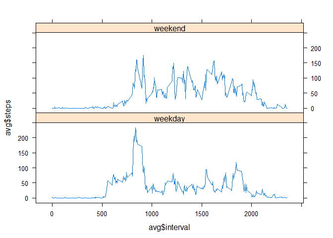

# Reproducible Research: Peer Assessment 1


## Loading and preprocessing the data

```r
activity <- read.csv("~/GitHub/RepData_PeerAssessment1/activity/activity.csv")
```

## What is mean total number of steps taken per day?

Below you can see a histogram of the total number of steps taken per day.

```r
total <- tapply(activity$steps, activity$date, FUN=sum, na.rm=TRUE)

hist(total)
```

 

```r
mea <- mean(total, na.rm=TRUE)
median <- median(total, na.rm=TRUE)
```
The average steps taken per day is 9354.2295082, while the median is 10395

## What is the average daily activity pattern?
Below you can see a time series plot of the 5-minute interval (x-axis) and the average number of steps taken, averaged across all days (y-axis).

```r
avg <- aggregate(x=list(steps=activity$steps), by=list(interval=activity$interval), FUN=mean, na.rm=TRUE)
plot(avg$interval, avg$steps, type='l')
```

 

```r
max <- avg[which.max(avg$steps),'interval']
max2 <- avg[which.max(avg$steps),'steps']
```
Interval 835 contains the maximum number of steps(206.1698113).

## Imputing missing values

```r
missing <- is.na(activity$steps)
miss <- sum(missing)
```
There are 2304 missing values. I've imputed them with the average value of steps. Below you can see a histogram of the total number of steps, now with missing values imputed.


```r
activity$filled <- NA
for (i in 1:length(activity$date)){
  if (!is.na(activity[i, 'steps'])){
    activity[i, 'filled'] <- activity[i, 'steps']
  }
  else {
    activity[i, 'filled'] <- mea
  }
}
total <- tapply(activity$filled, activity$date, FUN=sum, na.rm=TRUE)
hist(total)
```

 

```r
mean2 <- mean(total)
median2 <- median(total)
```
Since we imputed values, the mean and median will also change to 3.6266808\times 10^{5} and 1.1458\times 10^{4} respectively. By imputing missing values with the average, the total number of steps per day will go up.

## Are there differences in activity patterns between weekdays and weekends?
For this part, we first need to create a new variable which contains information about whether the day is a weekday or a weekend. For this, we can use the build-in function weekdays, which extracts the day of the week (f.e. monday, tuesday,..) from the date in the dataset. Afterwards, we change the days trough weekday or weekend.

```r
activity$day <- weekdays(as.Date(activity$date))
activity[activity$day %in% c('zondag', 'zaterdag'),'week'] <- 'weekend'
activity[!activity$day %in% c('zondag', 'zaterdag'),'week']<- 'weekday'
avg <- aggregate(steps~ interval+week, data=activity, FUN=mean, na.rm=TRUE)
```
Next we can make the plot. Since we're not using the base plotting system, we need to load the lattice library to be able to plot the values. Below you can see the result.

```r
library(lattice)
xyplot(avg$steps ~ avg$interval | avg$week, layout = c(1, 2), type='l')
```

 

```r
head(avg)
```

```
##   interval    week     steps
## 1        0 weekday 2.3333333
## 2        5 weekday 0.4615385
## 3       10 weekday 0.1794872
## 4       15 weekday 0.2051282
## 5       20 weekday 0.1025641
## 6       25 weekday 1.5128205
```

